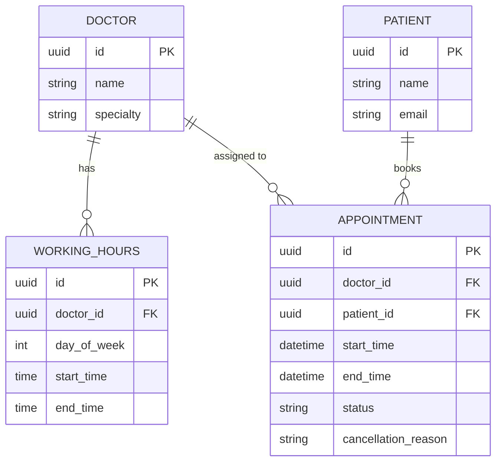

# Clinic Booking System — Data Model

This document describes the database design for the clinic booking assessment.

## How to read the diagram below

The diagram uses **crow's foot notation**, a standard way of showing how table rows relate to each other:

| Symbol | Meaning |
|---|---|
| `\|\|` | exactly one |
| `o{` | zero or many |
| `PK` | Primary Key — the unique ID for that table's own rows |
| `FK` | Foreign Key — a column that points to another table's row |

Example: `DOCTOR \|\|--o{ WORKING_HOURS` reads as *"one doctor has zero or many working-hours rows"* — a doctor can have several working-hour entries (one per weekday), but every working-hours row belongs to exactly one doctor.

## Entity-relationship diagram

Paste this block into any Mermaid renderer (GitHub renders it automatically inside a README, or use https://mermaid.live to view it standalone):

## Table-by-table breakdown

### Doctor
| Field | Type | Notes |
|---|---|---|
| id | UUID | Primary key. A long random unique code rather than 1, 2, 3... — harder to guess, safer habit around any patient-adjacent data. |
| name | string | |
| specialty | string | Optional. |

### WorkingHours
One row per doctor, per weekday.

| Field | Type | Notes |
|---|---|---|
| id | UUID | Primary key |
| doctor_id | UUID (FK → Doctor.id) | Which doctor this block belongs to |
| day_of_week | int (0–6) | 0 = Monday ... 6 = Sunday |
| start_time | time | e.g. 09:00 |
| end_time | time | e.g. 17:00 |

**Design decision:** each doctor gets exactly one continuous working block per day (e.g. 9am–5pm), not split shifts (e.g. 9–12 and 2–5). Real clinics sometimes run split shifts — this is a known, intentional limitation, not an oversight. Supporting split shifts would mean allowing multiple `WorkingHours` rows per doctor per day, which complicates the availability-calculation logic for something the scenario didn't ask for.

### Patient
| Field | Type | Notes |
|---|---|---|
| id | UUID | Primary key |
| name | string | |
| email | string | |

### Appointment
The table that carries the actual business rule.

| Field | Type | Notes |
|---|---|---|
| id | UUID | Primary key |
| doctor_id | UUID (FK → Doctor.id) | |
| patient_id | UUID (FK → Patient.id) | |
| start_time | datetime | |
| end_time | datetime | start_time + 30 minutes |
| status | string | `booked` or `cancelled` |
| cancellation_reason | string | Nullable — only set when status = cancelled |

**Design decisions:**
- **Cancelling never deletes the row** — it flips `status` to `cancelled` and records why. A clinic needs an audit trail; a deleted row can't answer "did this patient have a 2pm slot last Tuesday?"
- **Rescheduling updates the existing row's `start_time`/`end_time`** rather than creating a new appointment — same patient, same appointment identity, just a different slot. The old slot is validated as freed and the new slot is validated exactly like a fresh booking.
- **Double-booking prevention lives in the database, not just the application code.** There is a unique index on `(doctor_id, start_time)` scoped to rows where `status = 'booked'`. If two requests try to book the same doctor/slot at the exact same instant, the database itself rejects the second one — this closes a race condition that a "check, then write" approach in Python alone could miss.

## No separate "Slot" table

Available slots are *calculated on the fly* from `WorkingHours` minus existing `booked` Appointments, rather than stored as their own table. Trade-off: slightly more computation per availability request (negligible at clinic scale), in exchange for a simpler schema that can never drift out of sync with itself.